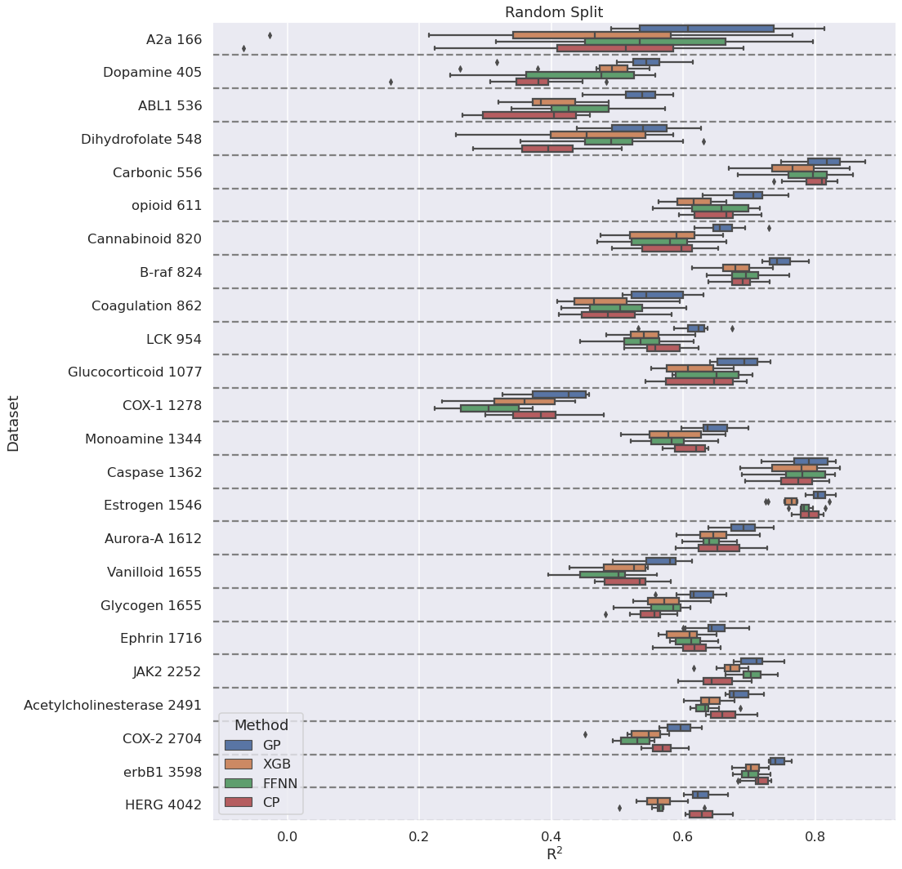
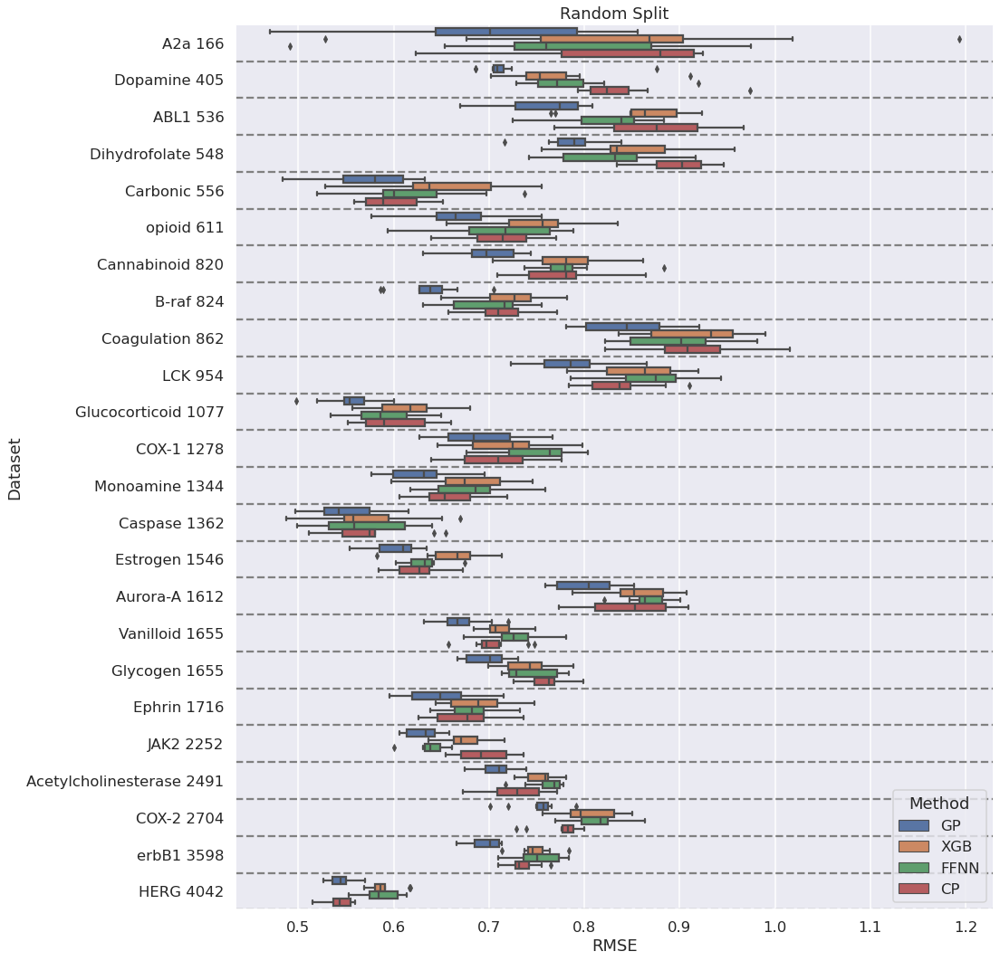
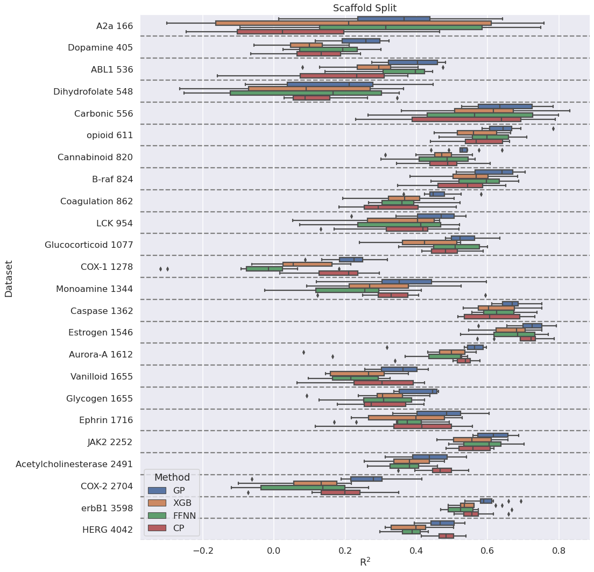
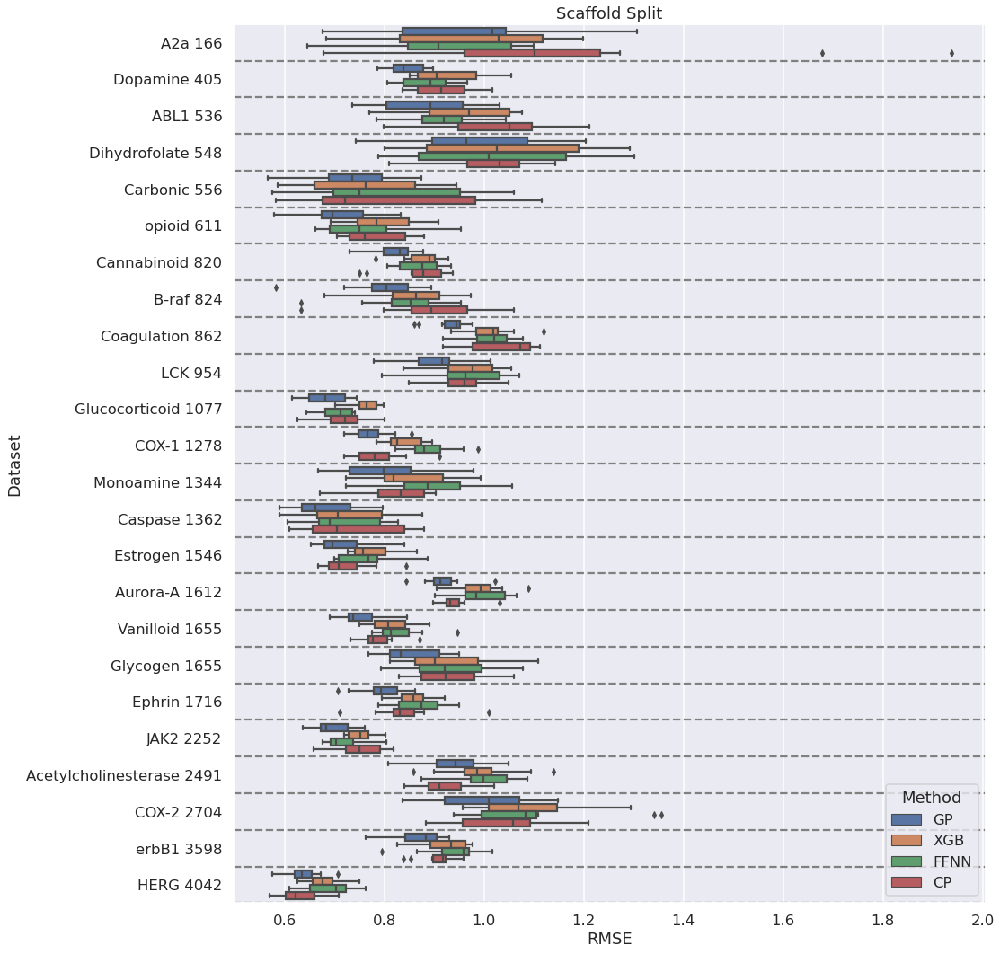

# yamc
Yet another ML method comparison, a comparison of 
* Gaussian Process Regression (GP)
* XGBoost (XGB)
* FeedForward Neural Network (FFNN)
* ChemProp (CP)

We are only comparing algorithms for GP, XGB and FFNN. The same descriptors (RDKit Morgan2) are used for all three. 

Datasets are from [https://pubs.acs.org/doi/10.1021/acs.jcim.8b00542](https://pubs.acs.org/doi/10.1021/acs.jcim.8b00542)

## Procedure

1. fixed_comparison.py - writes output to comparison.csv
2. run_chemprop.py (this takes several days, I could probably make it faster)
3. analyze_chemprop.py - writes output to cp_comparison.csv
4. analysis.ipynb - read comparison.csv and cp_comparison.csv and generates plots

## Random Splits 

## Scaffold Splits 

