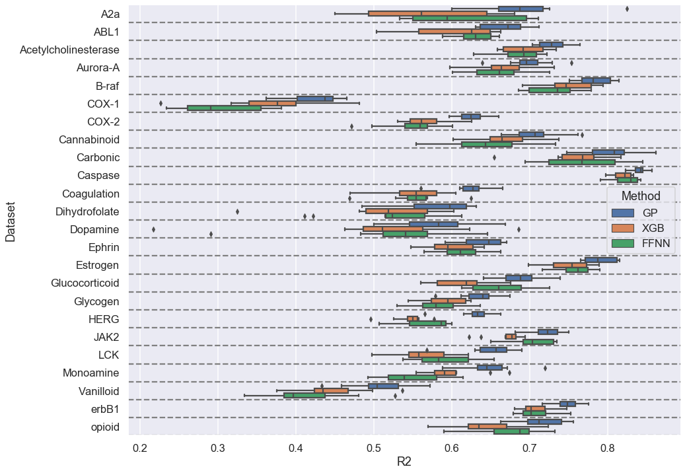
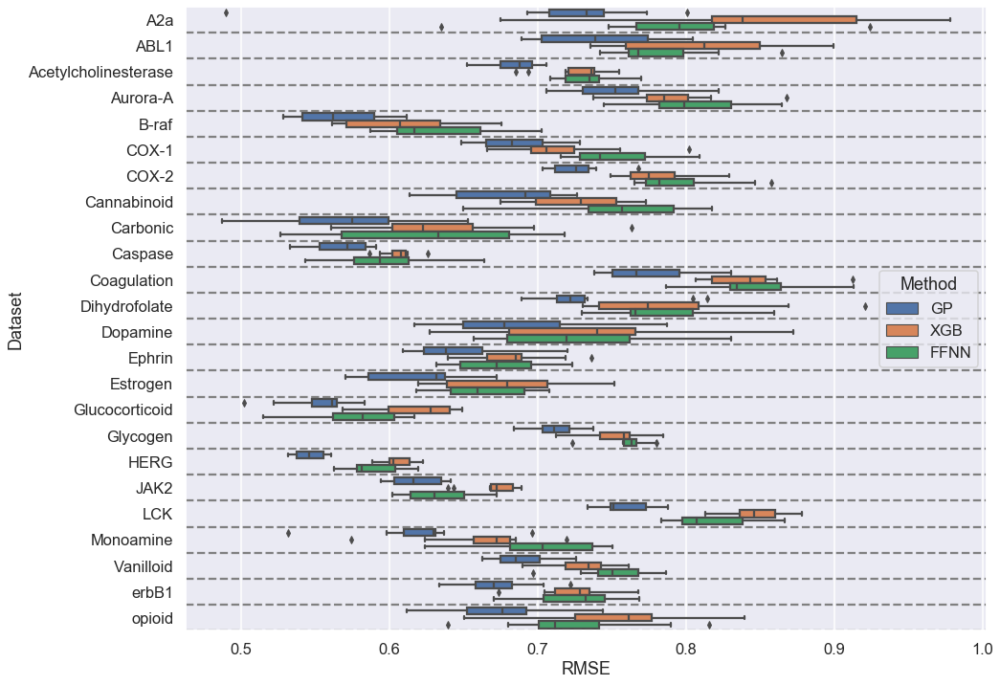

# yamc
Yet another ML method comparison, a comparison of 
* Gaussian Process Regression
* XGBoost
* FeedForward Neural Network
We are only comparing algorithms here, the same descriptor (RDKit Morgan2) are used throughout.

